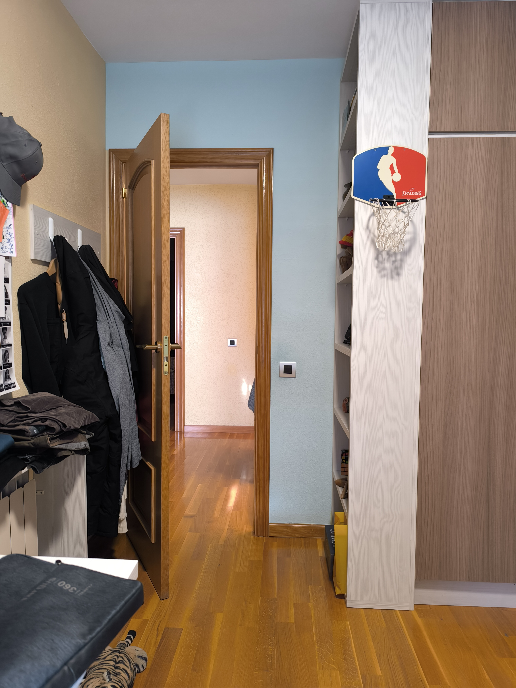
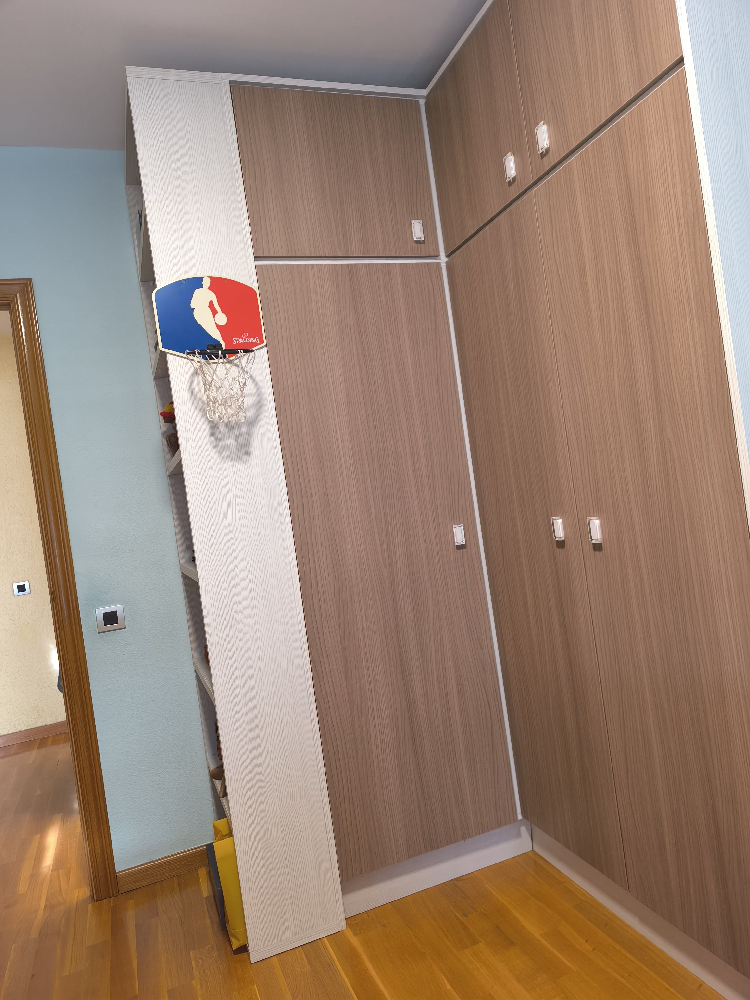
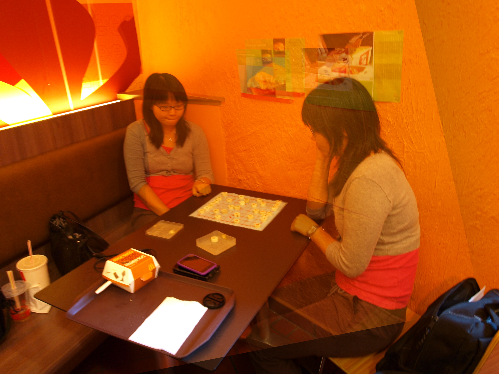

# Custom Image Stitcher (Python + C++ + some OpenCV)

This project is a **custom panorama stitching pipeline** built using Python and C++, trying not to rely too much on OpenCV’s modules.  
The purpose was **pure learning** — understanding every step of panorama creation by re-implementing key computer-vision components manually. I haven't yet implement the SIFT algorithm myself since any optimization mistakes could be extremely costly for compute time. 

As I mentioned, it’s not the most optimized or production-ready stitcher, but it demonstrates the full process clearly and transparently.

---

## Problem

Stitching two images into a seamless panorama is much harder than it seems:

- Scenes can be **distorted, rotated, or shifted**, causing feature matching to fail.
- Simply overlaying images leads to **misalignment**, ghosting, and loss of context.
- A robust stitcher needs:
  - reliable feature detection
  - feature matching
  - outlier rejection
  - homography estimation
  - image warping
  - blending
  - border cropping
  - handling large canvas transforms

Relying on OpenCV’s `Stitcher` hides all of that — so this project recreates the entire pipeline manually.

---

## Implementation

### **1. Custom feature matcher in C++**
I implemented a **brute-force k-NN descriptor matcher** using PyBind11, including:

- manual Euclidean distance computation  
- k-NN search  
- Lowe’s ratio test  
- Python bindings to integrate with the pipeline  

It’s not as fast as OpenCV’s optimized BFMatcher, but it helped understand how descriptor matching works.

---

### **2. Homography canvas computation**
My first implementations overlapped the images because I didn't resize the canvas properly.

In the end, I implemented:

- Perspective-transforming all image corners  
- Computing a **global bounding box**  
- Translating everything into positive coordinates  
- Warping images into this unified panorama space  

This allows images to extend the scene instead of overwriting each other.

---

### **3. Manual blending + border cropping**
To avoid sharp seams:

- Only the **true overlapping region** is blended  
- A simple linear/alpha blend is used  
- Finally, black borders from warping are automatically cropped

---

## Results

## 📥 Input Images

  
  

## 📤 Output Panorama

  

## Notes

- The goal wasn’t to build a state-of-the-art stitcher.
- The goal was to **understand every component** by rebuilding it myself.
- Most components (matcher, blending, grayscale, cropping, etc.) were written manually in Python or C++.
- This makes the project slower than OpenCV’s implementation, but far more educational.

**FUTURE GOALS:** Implement the SIFT myself using C++.
